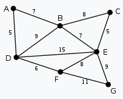

### Алгоритм Прима (нахождение минимального остовного дерева)

На вход алгоритма подаётся связный неориентированный граф. Для каждого ребра задаётся его стоимость.

Сначала берётся произвольная вершина и находится ребро, инцидентное данной вершине и обладающее наименьшей стоимостью. Найденное ребро и соединяемые им две вершины образуют дерево. Затем, рассматриваются рёбра графа, один конец которых — уже принадлежащая дереву вершина, а другой — нет; из этих рёбер выбирается ребро наименьшей стоимости. Выбираемое на каждом шаге ребро присоединяется к дереву. Рост дерева происходит до тех пор, пока не будут исчерпаны все вершины исходного графа.

Результатом работы алгоритма является остовное дерево минимальной стоимости. (в нашем случае новый граф, составленный из ребер мин. остовного дерева)

Мой пример:

")

### Кратко о реализации метода
Берем первую вершину в нашем графе. Добавляем ее в новый граф, который в будущем вернем. Проходимся в цикле [общее число вершин] - 1 (т.к. уже взяли одну, то -1).
Проходимся по вершинам нашего нового графа, смотря на его ребра, находим такое минимальное ребро, что его ещё нет в новом графе.
Добавляем вершину, связанную с минимальным ребром, в новый граф.
В конце выходит граф с тем же количеством вершин и минимальными ребрами (такими, что из любой точки можно попасть в другую любую точку, то бишь в конце выходит минимальное остовное дерево)
